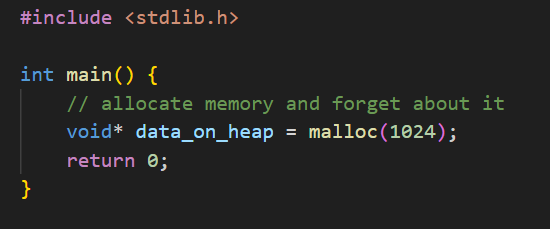
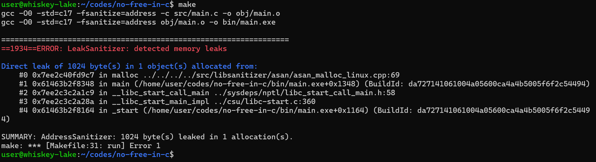
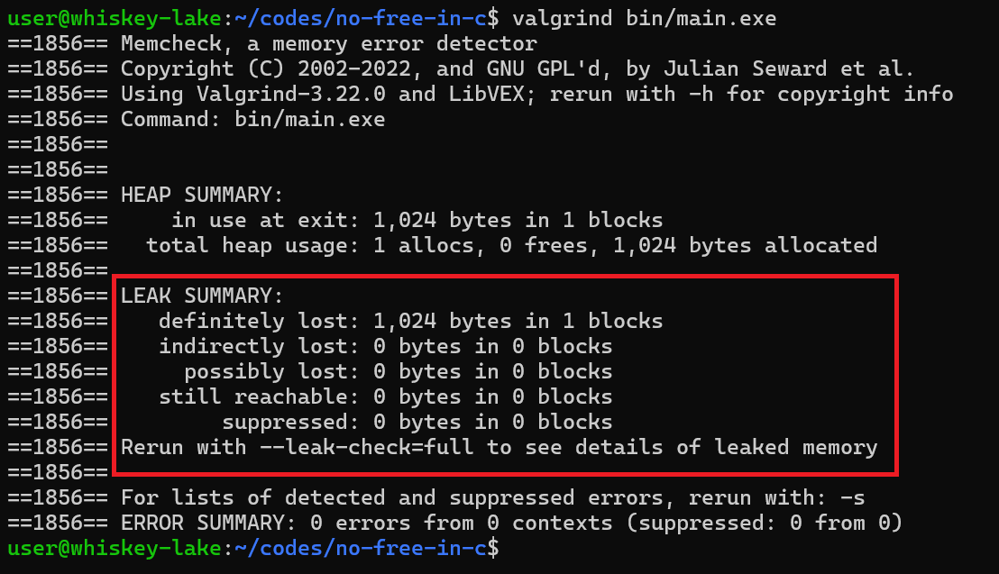
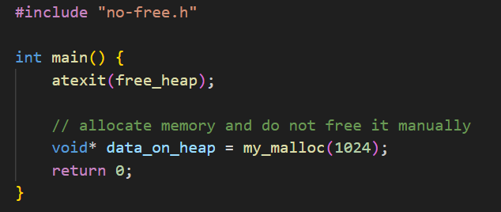
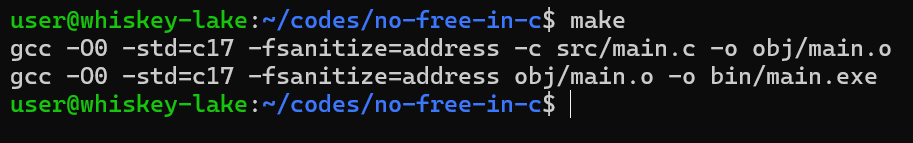
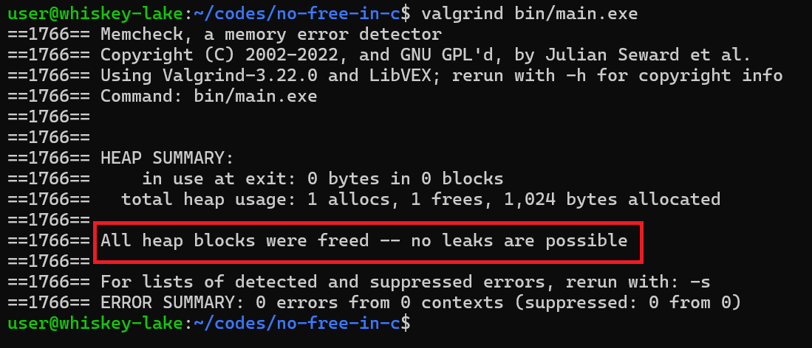

### Как забыть об утечках памяти в языке C с одним файлом .h

Этот proof-of-concept показывает, как без garbage collector'а выделять память и не думать о её деаллокации. Вся выделенная память будет освобождена автоматически при выходе из программы. Поэтому этот подход годится для программ с коротким жизненным циклом, и не годится для программ, которые должны работать постоянно в течение какого-то времени.  

### Пример обычного malloc() без вызова free()

 

### Утечки памяти с обычным malloc() без free()

 

 

### Пример my_malloc(), работающий без утечек памяти

 

### Утечек памяти нет

 

 

### Как запустить пример у себя

- Скачать пакеты gcc, make, valgrind
- В консоли переместиться в корневую папку проекта  
- Запустить команды
    `make`  
    `make run` 
    `valgrind bin/main.exe` 

### Как пользоваться my_malloc() в своём проекте

- Написать `#include "no-free.h"` там, где понадобится my_malloc(), и в исходнике с точкой входа в программу main().
- В начале функции main() написать `atexit(free_heap);`.
- Всё. Можно пользоваться my_malloc().

### TODO

~~При помощи my_malloc() реализовать my_calloc() и my_realloc().~~